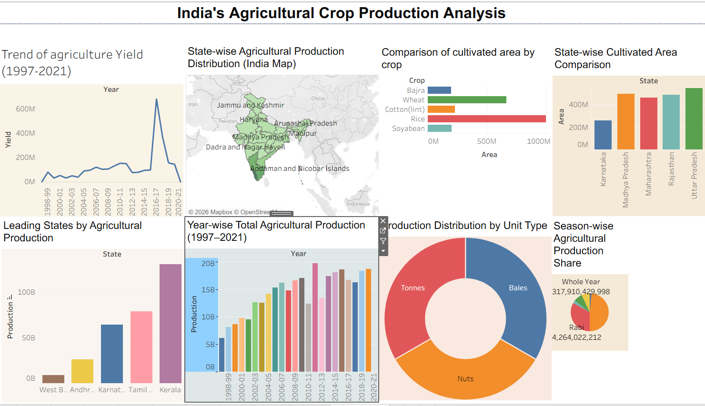
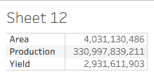

# 🌾 India's Agricultural Crop Production Analysis (1997–2021)

## 📖 Overview

This project presents an interactive analysis of India's agricultural crop production from **1997 to 2021** using **Tableau**. It provides insights into agricultural trends, crop production, cultivated areas, seasonal distribution, and state-wise performance through an interactive dashboard and data story.

The project aims to transform agricultural data into meaningful visual insights, enabling users to explore production patterns, compare state-wise performance, and analyze long-term agricultural trends.

---

## 🎯 Objectives

- Analyze agricultural production trends from 1997–2021.
- Compare crop production across Indian states.
- Identify leading agricultural producing states.
- Study agricultural yield and cultivated area.
- Analyze seasonal production patterns.
- Present insights using interactive dashboards and storytelling.

---

## 📊 Dashboard Features

The dashboard contains the following visualizations:

- 📌 **Total Production & Total Yield** – KPI Cards
- 📈 **Trend of Agricultural Yield (1997–2021)** – Line Chart
- 🗺️ **State-wise Agricultural Production Distribution** – India Map
- 🌾 **Crop-wise Total Production Analysis** – Horizontal Bar Chart
- 📊 **State-wise Cultivated Area Comparison** – Grouped Bar Chart
- 🏆 **Leading States by Agricultural Production** – Bar Chart
- 📅 **Year-wise Total Agricultural Production (1997–2021)** – Bar Chart
- 🍩 **Production Distribution by Unit Type** – Donut Chart
- 🥧 **Season-wise Agricultural Production Share** – Pie Chart

---

## 📖 Tableau Story

The Tableau Story presents the dashboard insights in a structured narrative, highlighting agricultural production trends, state-wise comparisons, crop analysis, seasonal patterns, and key findings.

---

## 📂 Dataset

The dataset covers India's agricultural crop production from **1997–2021** and includes:

- State
- District
- Crop
- Season
- Year
- Cultivated Area
- Production
- Yield
- Unit Type

---

## 🛠️ Technologies Used

- Tableau Desktop
- Tableau Public
- HTML5
- CSS3
- Bootstrap
- JavaScript

---

## ✨ Key Features

- Interactive Tableau Dashboard
- Interactive Tableau Story
- Responsive Website
- Dynamic Filtering
- State-wise Analysis
- Crop-wise Analysis
- Geographical Visualization
- Agricultural Trend Analysis

---

## 📷 Dashboard Preview

### Dashboard

### Story

---

## 🔗 Tableau Public

**Dashboard:** *(Paste your Tableau Dashboard URL here)*

**Story:** *(Paste your Tableau Story URL here)*

---

## 📌 Key Insights

- Agricultural production varies significantly across different states.
- A few states contribute a major share of India's agricultural output.
- Agricultural yield exhibits long-term trends and annual fluctuations.
- Seasonal variations have a significant impact on crop production.
- Interactive visualizations make agricultural data easier to understand and analyze.

---

## 👨‍💻 Author

**Shashank**

Agricultural Crop Production Analysis (1997–2021)
